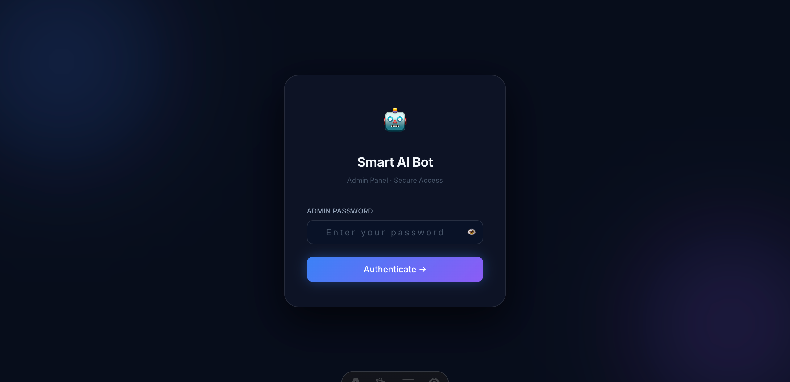
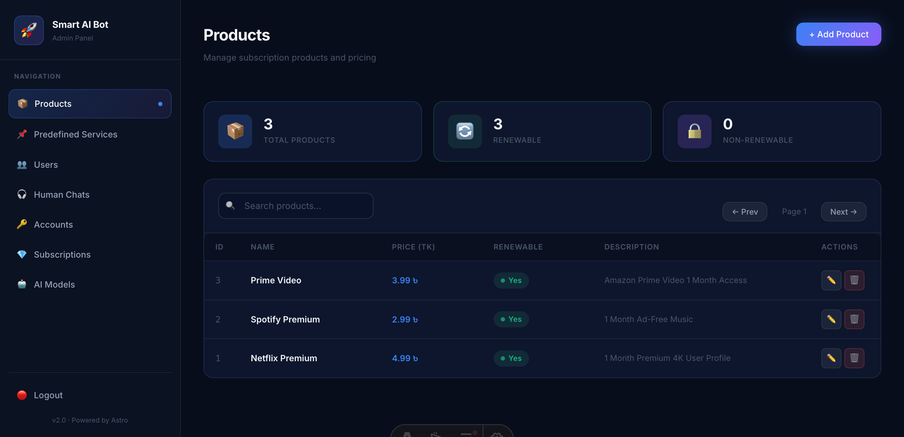
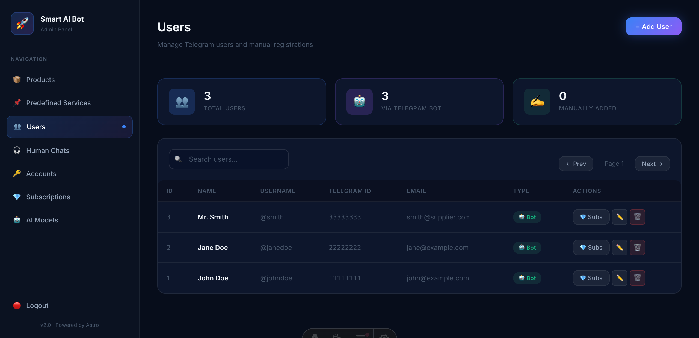
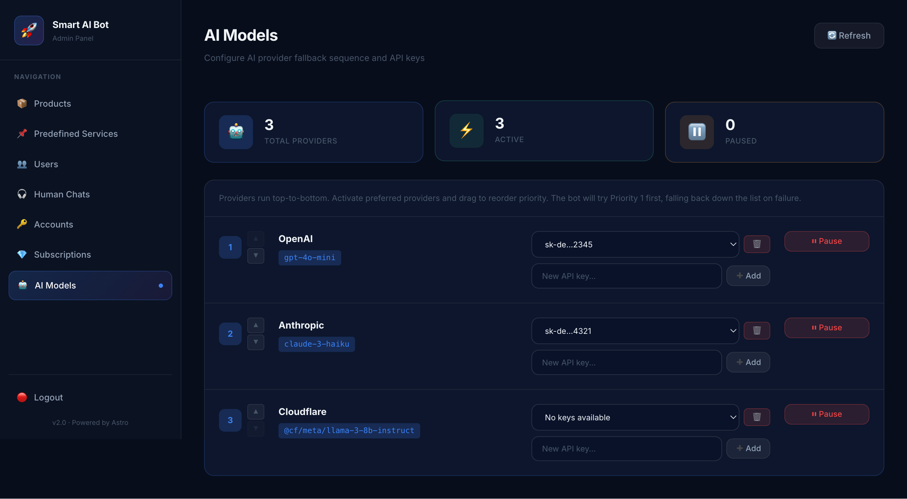
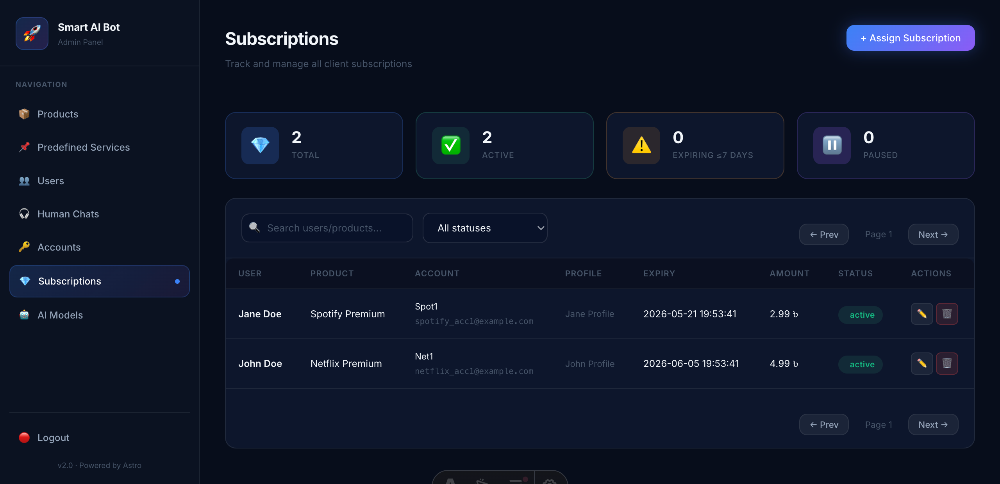
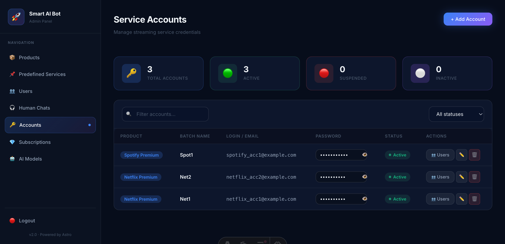

# Smart AI Bot

A robust, multi-worker Cloudflare project structured to provide an intelligent Telegram Bot with fallback AI integrations, background OTP handling, and a full-fledged Admin Panel.

This project is divided into three distinct Cloudflare Workers:
1. **bot-worker:** An intelligent Telegram bot handling user interactions, OTP checks, AI integrations (with cascade fallbacks), and webhook processing to DB.
2. **db-worker:** A centralized API and D1 Database worker that manages state, user subscriptions, and application data.
3. **admin-worker:** A web-based Admin interface built with Astro, allowing easy management of users, subscriptions, and AI providers.

---

## ✨ Project Highlights

- **Telegram Bot Integration:** Fully optimized for intelligent Telegram bot interactions.
- **100% Free Hosting:** Designed to run entirely on the **Cloudflare Free Tier** (Workers + D1 + R2).
- **Scheduled Tasks:** Integrated support for **Cron Triggers** to handle periodic tasks (reminders, cleanup, etc.).
- **Async Background Tasks:** Uses **Cloudflare Queues** for decoupled background processing (e.g., OTP delivery, data synchronization).
- **Smart AI Agents:** Supports **AI Function Calling** and tool use for complex multi-step reasoning.
- **Microservices Architecture:** Decoupled workers for Bot logic, Database API, and Admin Panel.

---

## 🤖 Core Bot Capabilities

The Telegram bot is not just a responder but a smart assistant with the following features:

- **Dynamic Pricing & Info:** Fetches real-time product prices and descriptions directly from the database to assist potential buyers.
- **Subscription Lookups:** Users can ask the bot about their active subscriptions, expiry dates, and profile details.
- **Automated OTP Retrieval:** Integrated with email APIs to automatically fetch and provide OTPs for accounts, eliminating manual intervention.
- **Proactive Reminders:** Automatically notifies users before their subscriptions expire (using Cron Triggers).
- **General Intelligence:** Capable of answering general queries and maintaining context-aware conversations using modern LLMs.
- **Function Calling:** Tools-enabled bot that can perform database lookups and API calls on-demand based on user intent.

---

## �️ Security & Privacy Logic

The system is designed with a "Security-First" approach to data access:

- **Strict Data Isolation:** The AI agent follows a sandboxed data retrieval pattern. It can only access records belonging to the specific user it is chatting with. Users cannot "prompt engineer" or bypass the system to view other users' data or unauthorized product details.
- **Expiry-Aware Access:** Credentials and sensitive account details are only provided if the user has an active, non-expired subscription. Once a subscription expires, the AI automatically restricts access to that information.
- **Secure Credential Delivery:** The bot securely delivers account credentials (emails/passwords) directly to the user within the private chat, ensuring privacy.

---

## �📸 Admin Panel Preview

Capture a glimpse of the powerful management interface:

| Login Page | Products Management |
| :---: | :---: |
|  |  |

| Users Overview | AI Models Config |
| :---: | :---: |
|  |  |

| Subscriptions | Account Details |
| :---: | :---: |
|  |  |

---

## 🏗 Project Architecture

```
smartbot/
│
├── bot-worker/          # Telegram Bot Worker (Webhook + Queue consumer)
├── db-worker/           # Centralized Database Worker (Cloudflare D1)
└── admin-worker/        # Admin Panel Worker (Astro + SSR)
```

## 🚀 Setup & Installation

To run this project or deploy to your own Cloudflare account, follow the instructions below.

### 1. Prerequisites
- **Node.js** (v18+)
- **Wrangler CLI** installed globally (`npm install -g wrangler`)
- A **Cloudflare** Account
- A **Telegram Bot Token** (from BotFather)

### 2. Configure DB Worker
The `db-worker` holds the core Cloudflare D1 Database.

1. Navigate to `db-worker/`:
   ```bash
   cd db-worker
   npm install
   ```
2. Create a D1 Database in Cloudflare:
   ```bash
   wrangler d1 create your-db-name
   ```
3. Update `db-worker/wrangler.toml` with the `database_name` and `database_id` returned from the command above. Update the `account_id` as well.
4. Execute the Schema:
   ```bash
   npm run d1:migrate:db
   ```
5. Deploy the `db-worker`:
   ```bash
   wrangler deploy
   ```

### 3. Configure Bot Worker
The bot processes AI commands and Telegram webhooks.

1. Navigate to `bot-worker/`:
   ```bash
   cd ../bot-worker
   npm install
   ```
2. Update `bot-worker/wrangler.toml`. Set your `account_id` and point the `LOCAL_DB_URL` string to your deployed `db-worker` URL.
3. Apply secrets (Required):
   ```bash
   wrangler secret put TELEGRAM_BOT_TOKEN
   wrangler secret put DB_SECRET_TOKEN
   ```
4. Deploy the bot:
   ```bash
   wrangler deploy
   ```

### 4. Configure Admin Worker
The Admin interface is constructed using Astro.

1. Navigate to `admin-worker/`:
   ```bash
   cd ../admin-worker
   npm install
   ```
2. Update `admin-worker/wrangler.toml` and `.env` with your Cloudflare `account_id` and the generic secrets/URLs for your deployed `db-worker`.
3. Set your production Admin password:
   ```bash
   wrangler secret put ADMIN_PASSWORD
   ```
4. Run locally:
   ```bash
   npm run dev
   ```
5. Deploy Admin dashboard:
   ```bash
   npm run deploy
   ```

---

## 💻 Local Development Workflow

To test the full functionality locally (Admin Panel + Database), you need to run two microservices simultaneously:

### 1. Start the Database Worker
This worker handles all D1 database operations and provides an API for the other workers.
```bash
cd db-worker
npm run dev
```
*By default, this runs on `http://127.0.0.1:8787`.*

### 2. Start the Admin Panel
In a **separate terminal**, start the Astro dev server.
```bash
cd admin-worker
npm run dev
```
*The Admin Panel will look for the database at the `LOCAL_DB_URL` defined in your `.env`.*

> [!TIP]
> **Production Connectivity:** In a live environment, the workers connect automatically via **Cloudflare Service Bindings**. No URLs are needed because the workers talk to each other directly through the Cloudflare backbone, ensuring high performance and security.

---

## � Admin Access & Authentication

The Admin Panel (`admin-worker`) is protected by a simple password-based authentication system.

- **Demo Password:** `admin123`
- **Login URL:** Your deployed URL + `/login` (e.g., `admin.yoursite.workers.dev/login`)

### Future Improvements & Security
This project uses a simplified authentication layer for demonstration purposes. For a production-ready system, you can easily upgrade the security by:
1. **Changing Password:** Update the `ADMIN_PASSWORD` secret in Cloudflare or `.env`.
2. **Integrating OIDC/OAuth:** Replace the current logic in `src/pages/api/login.ts` with providers like **Google**, **GitHub**, or services like **Auth0/Clerk**.
3. **Adding Middleware Checks:** The project already includes a basic middleware structure (`src/middleware/`) that can be expanded for robust session management.

---

## �🔒 Security Measures (Important)
- This boilerplate is sanitized. Please **do not commit** actual `.env` files or hardcode API keys. 
- Ensure `HOUSEHOLD_AUTH_SECRET` and `DB_SECRET_TOKEN` are uniquely generated random strings in your setup.
- Always use `wrangler secret put` for production variables.

## 📩 Custom Solutions & Contact

Looking to build or integrate a custom AI bot solution for your own business or specific use case? I can help you design, develop, and deploy intelligent automation systems tailored to your needs.

Feel free to reach out for collaborations or inquiries:
- **Email:** [hasansarker58@gmail.com](mailto:hasansarker58@gmail.com)

## 📄 License
This project is open-source and free to adapt.
